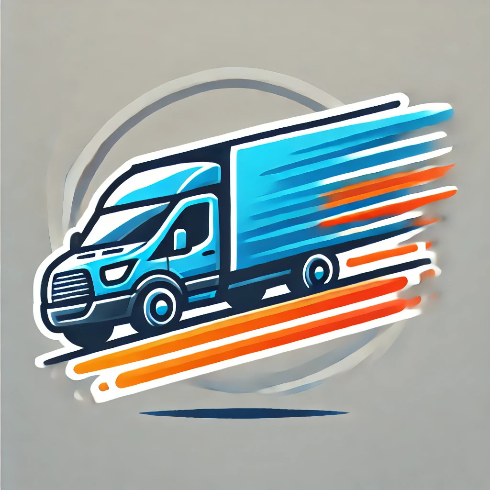

# Logistics Application

Welcome to the Logistics App project!


## Overview

The Logistics Application is designed to help manage and track the logistics of delivering packages via predefined routes. The system supports user registration, logging in as employees, managing routes, assigning trucks, and assigning packages to these routes. It calculates the expected arrival time of packages based on the departure time, distance, and average speed of the trucks.

## Features

- **User Registration and Login:**
  - Employees can register and log in to access the system.
  - Roles include `Manager` and `Worker`.

- **Route Management:**
  - Create routes with specified locations and departure times.
  - Assign trucks to routes.
  - Search for routes between specific locations.

- **Package Management:**
  - Create packages with details such as start and end locations, weight, and customer contact information.
  - Assign packages to routes, with the system automatically calculating and setting the expected arrival time.
  - View details of unassigned packages.
  - View detailed information about specific packages.

- **Truck Management:**
  - Assign trucks to routes based on availability and capacity.
  - View details of available trucks and their assignments.

- **Calculation of Expected Arrival Time:**
  - The system calculates the expected arrival time for each package based on the departure time and distance to the destination.

## Setup Instructions

1. **Clone the Repository:**

   ```bash
   git clone https://github.com/your-username/logistics-application.git
   cd logistics-application
   ```
   
## 2. Run the Application:

To start the application, run:

   ```bash
   python main.py
   ```

## Usage Instructions

### Initial Options:

- **Register as a New Employee:**
  - You will be prompted to enter a username, first name, last name, password, role (Manager/Worker), and contact information.

- **Log in as an Existing Employee:**
  - Enter your username and password to log in.

### Main Menu Options (After Logging In):

- **Create Package:**
  - Enter the package ID, start location, end location, weight, and customer contact information.

- **Create Route:**
  - Enter the route ID, locations (separated by spaces), and the departure date and time.

- **Assign Truck to Route:**
  - Enter the truck ID and the route ID to assign the truck to a specific route.

- **Assign Package to Route:**
  - Enter the package ID and route ID to assign the package to the specified route. The system will calculate and display the expected arrival time.

- **View Routes:**
  - Displays all the routes, their assigned trucks, total distance, departure time, and expected arrival times of the packages.

- **Search Route:**
  - Enter the start and end locations to search for routes between those points. The system will display the full route details, including the times of arrival at each stop.

- **Logout:**
  - Logs you out of the system and returns you to the initial options menu.

- **View Unassigned Packages:**
  - Displays a list of packages that have not yet been assigned to any route.

- **View Available Trucks:**
  - Shows a list of trucks that are currently available and not assigned to any route.

- **View Package Details:**
  - Enter the package ID to view detailed information about that specific package, including its current status and expected arrival time.

## Example Use Case

### Use Case: Package Delivery

1. A customer brings a package to the Sydney office for delivery to Melbourne.
2. An employee logs in and records the package details.
3. The employee searches for available routes between Sydney and Melbourne.
4. The system suggests two routes, displaying the expected arrival times.
5. The employee selects the most suitable route and assigns the package to it.
6. The system confirms the package assignment and provides the expected arrival time.

## Error Handling

The application includes error handling for scenarios such as attempting to assign a package to a non-existent route, assigning a truck to a route that already has a truck, and other invalid operations.

## Contributing

If you wish to contribute to this project, feel free to submit pull requests or report issues. Your contributions are welcome!


## Acknowledgments

Thanks to everyone who contributed to this project.

